# Git Flush: *Toilet humor for struggling devs* 😢
Flushes git commits with poop-themed cheers. 

> Nobody needs to tell me that my commits are shit 😤

| Image | Description | Relevance to `git-flush` |
|-------|-------------|--------------------------|
|  | *Better Call Saul*, the iconic suggestive toilet scene. | Inspires the poop-themed messages (e.g., “Oops! Saul's toilet's dry”) and toilet flush sound (`flush.wav`) for the `:GitFlush` command. |
|  | Claptrap, the quirky robot from *Borderlands*. | Fuels the cheerleader vibe with over-the-top, funny commentary for git commits, like Claptrap hyping your git commit with poop jokes. |

## Some Workflow

```mermaid
graph TD;
  H[":GitFlush 🚽"] --> B["Check: Is it a git repo? ❓"]
  B --> |"Yes ✅"| I["git commit 📝"]
  B --> |"No ❌"| D["Show error: 'No git repo, Saul’s toilet’s dry!' 😢"]
  I --> J{"Was it a success? ❓"}
  J --> |"❤️ Yes"| K["Generate a celebratory poop joke! 💦"]
  J --> |"No 🚫"| L["Generate an encouraging poop comment to try again! 😤"]
  K --> M{"Was poop message generated? ❓"}
  L --> M
  M --> |"❤️ Yes"| N["Append commit output to generated poop message 📜💦"]
  M --> |"No 🚫"| O["Append commit output to random pre-made poop message 📜💩"]
  N --> P["Display message 🎉"]
  O --> P
```

